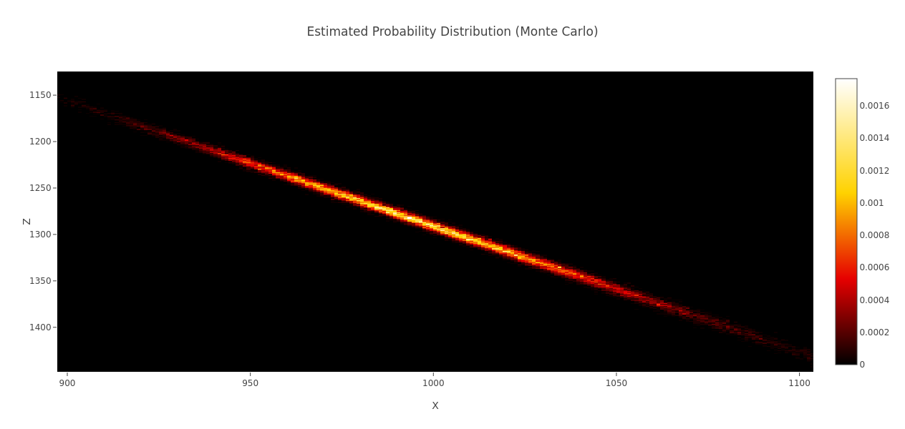

# End Portal Triangulator

The end portal triangulator is an application for Minecraft players to calculate the position of an end portal using two consecutive throws of an ender pearl.
The position is calculated using linear algebra and a Monte Carlo simulation is used to estimate the uncertainty. A full discussion can be found in the paper in [docs/paper/triangulation.pdf](./docs/paper/triangulation.pdf).

## Installation

The web app can be found in the `src` folder of the repository. It does not need to be installed.
To run the app simply open `triangulate.html` in a web browser. JavaScript needs to be enabled.

The application pulls the dependencies of `Plotly` and `math.js` from the internet, therefore a connection is required.

Alternatively you can visit the [online version hosted on GitHub Pages](https://davidkowalk.github.io/end_portal_triangulator/src/triangulate.html).

## User guide

Two eyes of ender are required for triangulation.
1. Open the debug screen, which is typically bound to the F3 button.
2. Throw the first eye of ender and place the crosshair above the hovering entity.
3. Enter the x and z position with the yaw angle (the first angle displayed in the "Facing" line) for the first coordinate.
4. Repeat 2. and 3. for a second location approximately perpendicular to the throwing direction. A larger separation between the two measurement locations yields lower uncertainties. A separation of at least 50 blocks is advised.
5. Click the "Update" button. After 1 to 3 seconds a location is displayed alongside a heatmap of estimated probability.

When the player is far from the stronghold the estimation accuracy may be insufficient. A "line shape" may appear in the histogram. Then optionally:

6. To refine the estimate travel to an off-axis location instead of the estimated stronghold position. Replace one measurement and recalculate the position. 

**Advanced Options**:
- The uncertainties can be adjusted in the dropdown menu.
- The number of samples drawn for the error estimation can be adjusted under "Monte Carlo Runs". A higher number of samples leads to a cleaner distribution but will take longer to compute.   

## Example

Two pearl throws were recorded:

Throw   | x | z | Angle $\theta$
--------|---|---|-------
1       | 10| 33| -38.2°
2       |119| 19| -34.7°

The following uncertainties were used: $\Delta x = \Delta z = 0.5$ and $\Delta \theta = 0.1°$. The calculated position of the stronghold is
X | Z
--|--
998.5±38.5 | 1289.2±52.2

<small>This project was published on the [TMC Research Papers Discord Server](https://discord.gg/N9rxV4fwnH)</small> 